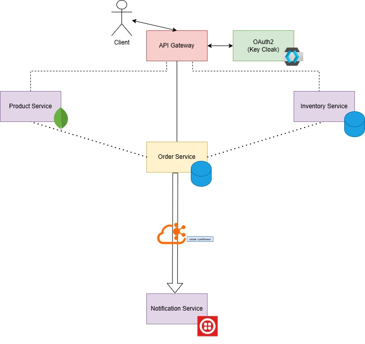

## System Overview
This architecture implements a modern microservices-based e-commerce system with the following components:

* API Gateway: Centralized entry point for all client requests
* OAuth2/KeyCloak: Handles authentication and authorization
* Product Service: Manages product catalog and information
* Inventory Service: Tracks product stock and availability
* Order Service: Processes customer orders
* Notification Service: Handles customer notifications
* Kafka: Event streaming platform for asynchronous communication

## Technology Stack

* Spring Boot: Framework for building microservices
* Spring Cloud: Provides tools for building distributed systems
* Keycloak: Open source identity and access management
* Kafka: Event streaming platform for asynchronous communication
* Docker & Docker Compose: Containerization and orchestration
* Databases: Each service has its own database (SQL/NoSQL)

## Setup and Configuration

* Clone the repository
```bash
git clone https://github.com/LeShaurya/Product_Store_Application.git
cd Product_Store_Application
```
* Set-up environment variables in docker-compose.yaml

### Running with Keycloak
* Ensure creation of `myrealm` realm.
* creation of client (client-credential grant type)
* using the client-id and client-secret generate a token to be authorized to use the resource-server.


## API Endpoints

### Product Service 
- Running on http://products:8090

| Method | Endpoint                         | Description                |
|--------|----------------------------------|----------------------------|
| GET    | `/api/products`                  | Get all products           |
| POST   | `/api/products`                  | Create a new product       |
| GET    | `/api/products/{skuCode}`        | Get product by SKU code    |
| PUT    | `/api/products/{skuCode}`        | Update product by SKU code |
| DELETE | `/api/products/{skuCode}`        | Delete product by SKU code |
| GET    | `/api/products/{skuCode}/exists` | Check if product exists    |

#### Product DTO Structure
```json
{
  "skuCode": "string",
  "productName": "string",
  "category": "string",
  "price": 0.0,
  "vendor": "string"
}
```

### Order Service 
- Running on http://orders:8091

| Method | Endpoint      | Description        |
|--------|---------------|--------------------|
| POST   | `/api/orders` | Create a new order |

#### Order DTO Structure
```json
{
  "skuCode": "string",
  "quantity": 0,
  "customerName": "string",
  "customerEmail": "string",
  "customerPhone": "string",
  "shippingAddress": "string"
}
```

### Inventory Service 
- Running on http://inventory:8092

| Method | Endpoint                 | Description                 |
|--------|--------------------------|-----------------------------|
| PUT    | `/api/inventory/update`  | Update inventory quantity   |
| POST   | `/api/inventory/reserve` | Reserve inventory for order |

#### Inventory Update DTO Structure
```json
{
  "skuCode": "string",
  "quantity": 0
}
```

### Aggregated API documentation using Swagger UI:
- http://localhost:8093/swagger-ui/index.html

## Microservice Architecture


## Running Docker Compose
```bash
# Pull the latest versions of the images and start the services
docker-compose up --build

# To start the services in detached mode
docker-compose up -d

# To stop the running services
docker-compose down
```
